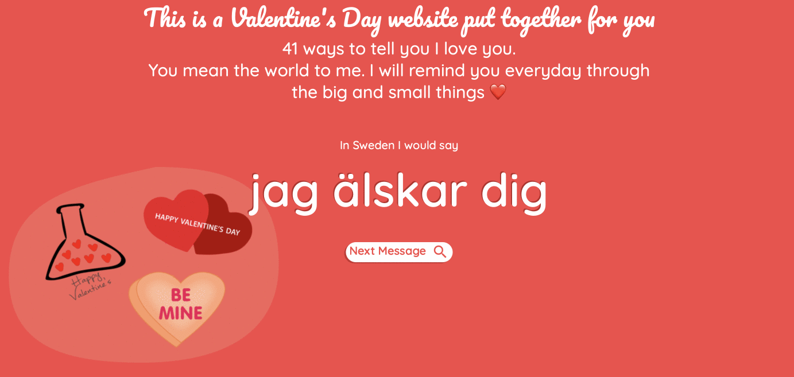

# ColorStack GBM: Valetine's Day Website Workshop❤️
<p align="center">

</p>

## What is this repo?
This repo is housing a variation of Juan Gustah's **Valentines** project. In diferent languages the message **I love you** will appear. This project is being cloned and used so that our memembers can practice using git and github while making a website for their loved
ones.

## Built With

* Html/Css/JavaScript
* Google Icons and fonts

## Testing

To use it,choose a folder where it will be cloned or repository, open the / cmd terminal and use the * git * command below:
```
git clone https://github.com/ColorStack-at-Stony-Brook-University/valentines-day-gbm.git
```

## License
This project is licensed under the MIT License - see the [LICENSE.md]
